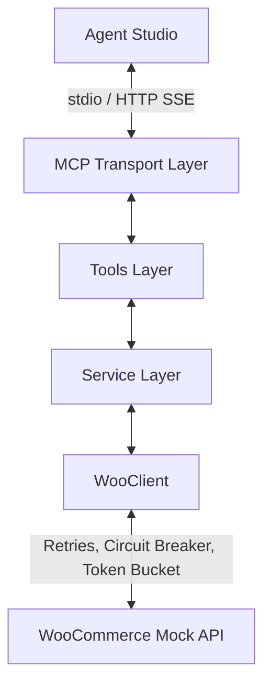

# woo-connector

A read-only Model Context Protocol (MCP) server that exposes a WooCommerce store's orders and products to AI agents. Built for Agent Studio-style agents, the core engineering focus is a highly resilient client layer featuring token-bucket rate limiting, jittered retries, and a circuit breaker to ensure stability under agent-driven load. See [docs/CAPABILITIES.md](docs/CAPABILITIES.md) and [docs/LIMITATIONS.md](docs/LIMITATIONS.md) for deeper detail.

## What it does

**Available Tools**
- `list_orders`: Retrieves paginated orders with optional date and status filters.
- `get_order`: Fetches a single order by ID.
- `search_orders`: Searches for orders by customer email or generic query.
- `list_products`: Retrieves paginated products with category and stock status filters.
- `get_product`: Fetches a single product by ID.
- `search_products`: Searches products by name or SKU.
- `check_stock`: Fast query returning only product stock status and quantity.

**Engineering Highlights**
- **Token-bucket rate limiting**: Enforces a strict local concurrency limit before requests hit the network (`src/client/rate-limiter.ts`).
- **Retry with Retry-After and jitter**: Automatically handles HTTP 429 and 50x responses, parsing `Retry-After` headers and applying exponential backoff with full jitter (`src/client/woo-client.ts`, `src/client/retry.ts`).
- **Circuit breaker**: Fails fast after a threshold of consecutive failures, moving to a half-open state for recovery (`src/client/circuit-breaker.ts`).
- **GET cache**: In-memory TTL caching for immutable or slow reads to reduce redundant agent fetches (`src/client/cache.ts`).
- **Hashed rotatable bearer tokens**: Agent authentication over HTTP uses SHA-256 hashed tokens managed via the admin console (`src/security/tokens.ts`).
- **PII masking**: Enabled by default to redact customer names, emails, and physical addresses from LLM contexts (`src/services/base-service.ts`).
- **Pagination handling**: Parses WooCommerce `X-WP-Total` and `X-WP-TotalPages` headers to supply agents with pagination metadata.
- **Zod validation**: Fails fast on malformed agent inputs before initiating network requests (`src/tools/schemas.ts`).

## Architecture



The system uses a strict four-tier layout. The Transport handles standard MCP JSON-RPC, which routes to Zod-validated Tools. Tools delegate to Domain Services that manage data shaping and PII redaction, which finally call the WooClient layer responsible for all network fault tolerance. For more details, see [docs/ARCHITECTURE.md](docs/ARCHITECTURE.md).

## Quick start

**Prerequisites**
- Node.js 20+

**Installation**
```bash
git clone https://github.com/Chaitanya0210/Woo-Commerce.git Woo-Commerce
cd Woo-Commerce
npm install
```

**Demo (No Account Required)**
The project includes a synthetic mock WooCommerce server and seeded data to observe fault tolerance locally.
```bash
npm run demo
```

**Running the Server**
Start over stdio (standard local MCP execution):
```bash
npm start
```

Start over HTTP (SSE transport + Admin Console on port 3000):
```bash
npm start http
```

**Development & Validation**
```bash
npm run lint
npm run typecheck
npm test
```

## Configuration

Copy `.env.example` to `.env` to configure the server. Do not commit `.env` or any real credentials to the repository.

| Variable | Required | Default | Description |
| -------- | -------- | ------- | ----------- |
| `WOO_URL` | Yes | `http://localhost:3999` | WooCommerce store URL |
| `WOO_KEY` | Yes | `ck_mock` | WooCommerce Consumer Key |
| `WOO_SECRET` | Yes | `cs_mock` | WooCommerce Consumer Secret |
| `ADMIN_PORT` | No | `3000` | Port for HTTP server and Admin API |
| `AGENT_AUTH_TOKEN` | No | `agent-dev-token` | Bearer token for HTTP transport |
| `ENABLE_PII` | No | `false` | Set to `true` to disable PII masking |
| `LOG_LEVEL` | No | `info` | Pino log level (info, debug, warn, error) |

## Connecting to an agent

**Over stdio**
Configure your agent platform to spawn a child process:
- Command: `npx`
- Args: `["tsx", "src/index.ts"]`

**Over HTTP (SSE)**
Provide the agent with the SSE endpoint URL and bearer token:
- URL: `http://localhost:3000/mcp/sse`
- Header: `Authorization: Bearer <AGENT_AUTH_TOKEN>`

## Tool reference

| Tool | Inputs (Optional) | Returns |
| ---- | ----------------- | ------- |
| `list_orders` | `page`, `per_page`, `after`, `before`, `status` | Paginated orders array with metadata |
| `get_order` | `id` (Required) | Single order object |
| `search_orders` | `search`, `customer_email`, `page`, `per_page` | Paginated orders array matching search |
| `list_products` | `page`, `per_page`, `category`, `stock_status` | Paginated products array with metadata |
| `get_product` | `id` (Required) | Single product object |
| `search_products`| `search`, `page`, `per_page` | Paginated products array matching search |
| `check_stock` | `id` (Required) | Stock status and quantity subset |

For detailed input schemas, see [docs/mcp-tools.json](docs/mcp-tools.json).

## Testing

The repository contains 22 passing tests covering unit and integration layers. Run them with `npm test`. The integration suite bypasses standard unit mocks and runs the real client and MCP server against a local Express-based mock store to exercise exact network behavior.

Verified failure scenarios against the mock store include:
- 401 Unauthorized and 404 Not Found handling.
- 429 Too Many Requests with exponential backoff honoring the `Retry-After` header.
- 503 Service Unavailable followed by successful recovery.
- Timeout (`ECONNRESET`) triggers and retry exhaustion.
- Malformed JSON parsing recovery.

## Design decisions and limitations

- **Read-only by design**: Prevents agents from accidentally modifying store state or placing orders.
- **PII masked by default**: Customer details are redacted in the service layer before reaching the LLM context to prevent data leakage.
- **In-memory state**: Limits, caches, and circuit breakers use local memory, avoiding external dependencies for this assignment.
- **Mock data target**: By default, the app targets a synthetic store, as running load tests against live production environments was explicitly out of scope.

Known limitations and the production path:
- Multi-tenant credential handling is not supported (one server = one store).
- Rate limits and caches are not shared across multiple processes (requires Redis).
- Cache invalidation is TTL-based, not webhook-driven.
See [docs/LIMITATIONS.md](docs/LIMITATIONS.md) for more details.

## Project layout

```
woo-connector/
├── src/           # Domain logic, MCP tools, HTTP server, client resilience
├── web/           # React admin console
├── tests/         # Unit and integration test suites
├── docs/          # Architecture, limitations, capabilities, schemas
├── fixtures/      # Synthetic mock data
└── scripts/       # Dev, docs, and demo scripts
```

## License
MIT License
